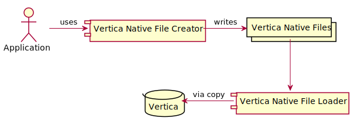

Vertica Native File Creator
===========================

This crate creates [Vertica Native Format](https://www.vertica.com/docs/9.2.x/HTML/Content/Authoring/AdministratorsGuide/BinaryFilesAppendix/CreatingNativeBinaryFormatFiles.htm
) (VNF) files. VNF files are optimized to load large amounts of data efficiently into a Vertica database.

Why Rust?
---------

Rust is a high performance, multi-paradigm system programming language focused
on safe concurrency and memory management.

Rust avoids many of the C/C++ traps and pitfalls with a consistent strong 
ownership model.

Rust was voted the "most loved programming language" in the Stack Overflow Developer Survey for 2016, 2017, 2018, and 2019.

API
----

	FileHeader::new(Vec[Types]) -> FileHeader
	
	RowData::new(Vec[Types], Vec[Data]) -> RowData
	
	VNF {
	  Vec[Types]
	}
	
	Impl VNF {
	  fn(&self, RowData) -> Vec[&u8]
	}

Example
-------

	let vnf_writer = VNFWriter::new(vec!(ColumnType::Integer,
	                                    ColumnType::Binary,
	                                    ColumnType::VarChar));

	                                    
	let vnf_file = File::new("vnf.bin")	
	
	vnf_file::from(vnf_writer.file_header());
	vnf_file::from(vnf_writer.row(18,0b11101010,"Hello VNF!"));
	
	

		                                    
		                                    

	
